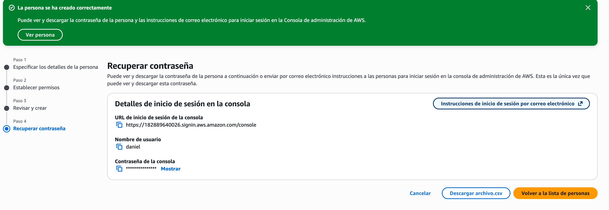
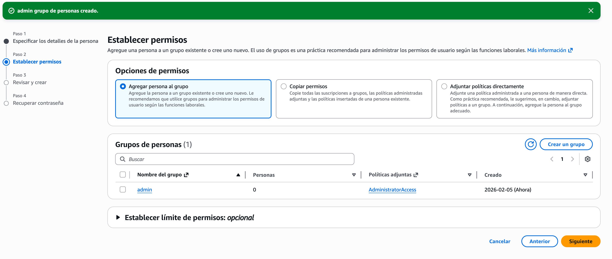
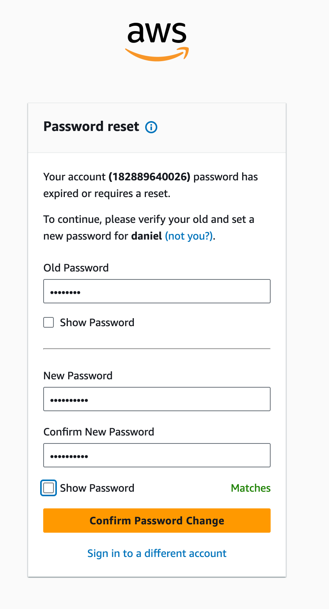
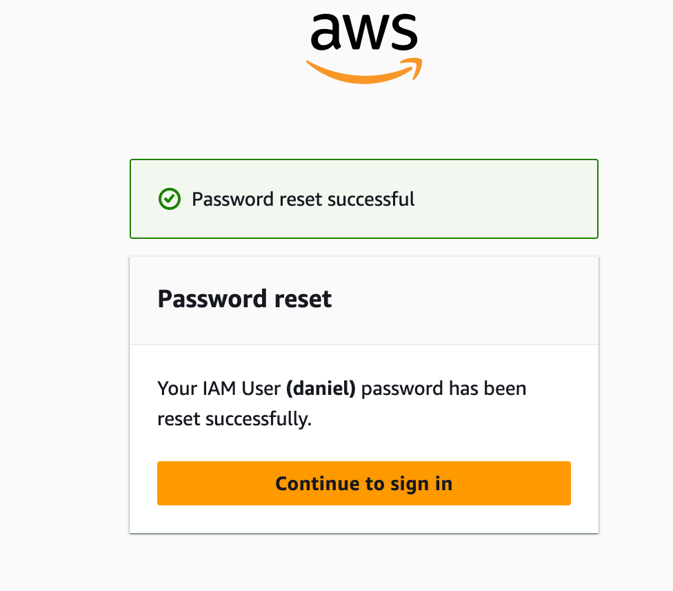
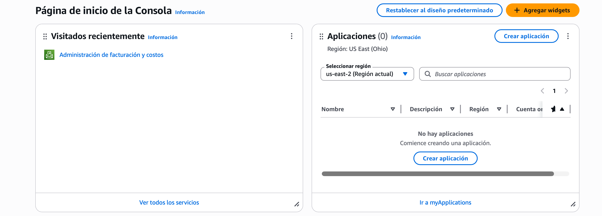

# IAM: Creación de Usuario y Grupo (Consola AWS)

## Objetivo
Crear un usuario IAM y asignarlo a un grupo con permisos administrativos,
evitando el uso del usuario root.

## Contexto
IAM (Identity and Access Management) es un servicio global de AWS que permite
gestionar identidades y permisos dentro de una cuenta.

## Pasos realizados en la consola

1. Accedí a la consola de AWS usando el usuario root.
2. Busqué el servicio **IAM**.
3. Entré a la sección **Usuarios**.
4. Creé un nuevo usuario con las siguientes características:
   - Nombre de usuario: `daniel`
   - Acceso a la consola de administración: habilitado
   - Contraseña: generada automáticamente
   - Cambio de contraseña en el primer inicio de sesión: habilitado

## Creación del grupo

1. Desde IAM, creé un grupo llamado `Admin`.
2. Asigné la política:
   - `AdministratorAccess`
3. Añadí el usuario `daniel` al grupo `Admin`.

## Configuración clave
- Usuario root solo se utilizó para la creación inicial.
- Los permisos se asignaron mediante grupo, no directamente al usuario.

## Resultado
El usuario `daniel` puede iniciar sesión en la consola de AWS y administrar
los servicios según los permisos definidos por el grupo `Admin`.

## Buenas prácticas aplicadas
- No usar el usuario root para tareas diarias.
- Uso de grupos para gestionar permisos.
- Principio de organización y escalabilidad.

## Aprendizajes
- IAM es un servicio global (no depende de regiones).
- Los grupos simplifican la administración de permisos.
- Los permisos determinan qué acciones puede realizar un usuario.

## Inicio de sesión por primera vez como usuario IAM

## Objetivo
Iniciar sesión en la consola de AWS utilizando un usuario IAM por primera vez,
verificando el flujo de autenticación y el cambio obligatorio de contraseña.

## Pasos realizados

### 1. Acceso a la página de inicio de sesión
Accedí a la página de inicio de sesión de AWS para usuarios IAM, utilizando:
- Account ID / Alias de la cuenta
- Nombre de usuario IAM
- Contraseña temporal generada al crear el usuario

---

### 2. Cambio obligatorio de contraseña
En el primer inicio de sesión, AWS solicitó cambiar la contraseña temporal
por una nueva contraseña personalizada.

Esto es una medida de seguridad para evitar el uso prolongado de credenciales
temporales.

---

### 3. Acceso a la consola como usuario IAM
Una vez cambiada la contraseña, se accedió correctamente a la consola de AWS
como usuario IAM.

Desde este punto, el usuario solo puede realizar acciones permitidas por los
permisos asignados a su grupo.

## Resultado
El usuario IAM pudo iniciar sesión correctamente y acceder a la consola de AWS
sin utilizar el usuario root.

## Buenas prácticas aplicadas
- Uso de usuario IAM en lugar de root
- Cambio obligatorio de contraseña en el primer acceso
- Acceso controlado mediante permisos de grupo

## Aprendizajes
- El primer login fuerza un cambio de contraseña por seguridad
- Los permisos visibles dependen del grupo asignado
- El usuario root no es necesario para operaciones diarias
